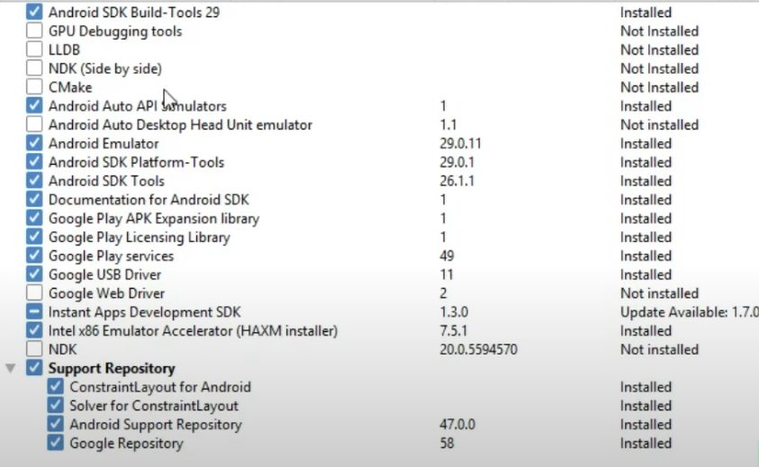
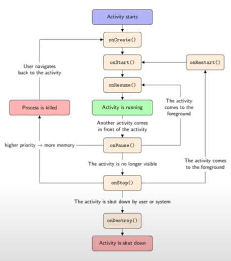

 [Setup Android Studio](#Setup-Android-Studio)   
 [footer](#footer)   
## Setup Android Studio
[Разработка приложений на Android Studio / Урок 1](https://www.youtube.com/watch?v=m9rONh99RXE&list=PLmjT2NFTgg1etsMV9DyEpdVbfPw29hwSA&index=2)  

Разработка приложений на Android Studio / Урок 1
На этом уроке установим программу Android Studio  настроим данную программу, создадим эмулятор для проверки приложений и загрузим наше первое приложение "Hello World".

[Developers Android Studio DOWNLOAD](https://developer.android.com/studio?hl=ru)

## 2 Start new AS project
- Start new AS project
- Empty Activity
### Configure your project
__|__
--|--
name | b0202lesson
Pacage name | com.example.b0202lesson 1
Save location | D:\avi02prog\b0202andr\b0202lesson
Language | Java
Minimum SDK | Api 23: Android 6.0 (Marshmallow)
   
1 - название сайта наоборот  
  
Finish  
SDK Manager  
    
Android 10  
Android 6  
  
Android SDK Build-Toolls  
Android Auto APIU Simulators  
Google Play APK Expansion library  
Google Play Instant Development SDK  
Google Play Licensing Library  
Google Play services  
Google USB Driver  
Google Web Driver  
Intel 86 Emulator Accelerator (HAXM installer)  

HAXM Emulator Settings RAM allocation 2.0 GB (Recommended)  

File Settings Editor Font Size 18   

### AVD Manager
new pixel 2  
Pixel 2 API 29 512M

## Разработка Android приложений/ Урок 2 / Activity

b0204lesson  

onCreate  
onStart  
onResume  
onStop
onDestroy     
onRestart  
  
## Android Studio Уроки Для Начинающих / Урок 3N


## Светофор Разработка Android приложений / Урок 3 - 1
[Разработка Android приложений / Урок 3 - 1](https://www.youtube.com/watch?v=PKGCAs_4p4w&list=PLmjT2NFTgg1c-CC0l6GuvpH7_2JZBxqzf&index=4)  
b0204traflite traffic light

LinerLayout horizontal
background grey  
Declared Attributes  
layout_width 100dp  
layout_heght 100dp  
layout_margin Top  28dp

bulb_1  
bulb_2  
bulb_3  

yellow

## Разработка Android приложений / Урок 3 - 2

onClick onClickStart  

```
```
## Разработка Android приложений / Урок 3 - 3

alt Enter import class

Start на кнопке - ничего не запущено start_strop = false  

start - no procesed  
stop - procesed  


## Navigation Drawer Activity
Разработка Android приложений/Урок 4-1/Справочник рыбака  
урок-4-справочник-рыбака  
[Урок 4: Справочник рыбака](https://neco-desarrollo.es/%D1%83%D1%80%D0%BE%D0%BA-4-%D1%81%D0%BF%D1%80%D0%B0%D0%B2%D0%BE%D1%87%D0%BD%D0%B8%D0%BA-%D1%80%D1%8B%D0%B1%D0%B0%D0%BA%D0%B0)  
[Разработка Android приложений/Урок 4-1/Справочник рыбака](https://www.youtube.com/watch?v=56OOq6aVse8&list=PLmjT2NFTgg1c-CC0l6GuvpH7_2JZBxqzf&index=9)  

b0206fishhand Fisher Handbook  
Navigation Drawer Activity  
layout\nav_header_main.xml
values\strings.xml
    <string name="nav_header_title">Android Studio</string>
    <string name="nav_header_title">Справочник рыбака</string>
id imageView
srcCompat 
drawable/img_02_02
layout_120dp  
layout_120dp  
layout_
D:\avi02prog\b0202andr\b0206fishhand\app\src\main\res\drawable
LinearLayout
Reference:	@color/des_def_color
Value:	#3f51b5
textColor holo_orange_light

## Добавление ресурса string-array
\app\src\main\res\values

## SharedPreferences
b0312pref  
[Сохранение данных на ANDROID/ УРОК 12N](https://www.youtube.com/watch?v=324Bq1CAq1w)  
[Урок 12N/SharedPreferences](https://neco-desarrollo.es/2020/09/%D1%83%D1%80%D0%BE%D0%BA-12n-sharedpreferences)  
```
    private void saveData(int counter1){
        SharedPreferences.Editor editor = pref.edit();
        editor.putInt(sCouter1, counter1);
        editor.apply();
    }

    private int readData(){
        counter1 = pref.getInt(sCouter1, 0);
        return counter1;
    }
```

## Jsoup Currency 
b0316curr  
[Приложение "Курс Валют" Часть 1/Парсинг сайта/Уроки по Android Studio Java](https://www.youtube.com/watch?v=Wi_xydwosx8&list=PLmjT2NFTgg1c-CC0l6GuvpH7_2JZBxqzf&index=48)  
[Парсинг сайтов: Урок 3](https://neco-desarrollo.es/2020/04/%D0%BF%D0%B0%D1%80%D1%81%D0%B8%D0%BD%D0%B3-%D1%81%D0%B0%D0%B9%D1%82%D0%BE%D0%B2-%D1%83%D1%80%D0%BE%D0%BA-3)  
[Парсинг сайтов урок 4](https://neco-desarrollo.es/2020/04/%D0%BF%D0%B0%D1%80%D1%81%D0%B8%D0%BD%D0%B3-%D1%81%D0%B0%D0%B9%D1%82%D0%BE%D0%B2-%D1%83%D1%80%D0%BE%D0%BA-4)  
[Минфин ua](https://minfin.com.ua/currency/)  

build.gradle   
dependencies
implementation 'org.jsoup:jsoup:1.13.1'  

Logcat Edit Filter Configuration
EnterName: MyLog
Log Tag: MyLog

app/src/main/AndroidManifest.xml
    <uses-permission android:name="android.permission.INTERNET" />


## How to use Git in Android Studio
[How to use Git in Android Studio](https://www.youtube.com/watch?v=_d4fFFAJKVA)  

File Settings Version Control Git
Test -> Git version 2.29.2

File Settings Version Control GitHub

The password is not saved and is only used to generate a GitHub token

github.com Settings / Developer settings / Personal access tokens

VCS Import into Version Control 
Share Project on GitHub
https://github.com/mlapinm/b0302hello
https://github.com/mlapinm/b0302hello
New repository name: AndrFreon
Description share


https://github.com/mlapinm/b02andr/a0503hello   
### push to toolbar
File Settings Menus and Toolbars Main Toolbar   
Navigation Bar Toolbar NavBarVcsGroup  
Main Toolbar MainToolBarSettings VCS Actions  

### to commit
View Tool Window Git  
context menu Reset Current Change to here  
hard  
  
## footer
[Android Developers Training Course overviews](https://developer.android.com/courses/fundamentals-training/toc-v2?hl=ru)  
[13 онлайн сервисов для создания своего мобильного приложения](http://itmentor.by/articles/13-onlajn-servisov-dlya-sozdaniya-svoego-mobilnogo-prilozheniya)  
[]()  
[]()  
[]()  
[]()  
[]()  
[]()  
[]()  
