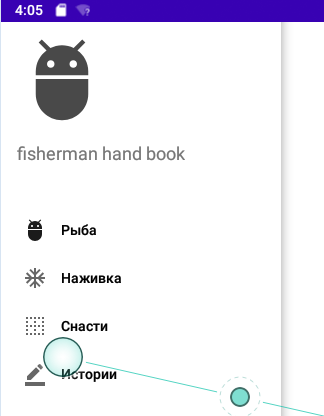

## Android Studio Kotlin

[Уроки по Kotlin на Android Studio 2020/Урок 1 - YouTube](#Уроки-по-Kotlin-на-Android-Studio-2020/Урок-1---YouTube)  
[Уроки по Kotlin на Android Studio 2020/Урок 2 - YouTube](#Уроки-по-Kotlin-на-Android-Studio-2020/Урок-2---YouTube)  
[Уроки по Kotlin на Android Studio 2020/Урок 3 - YouTube](#Уроки-по-Kotlin-на-Android-Studio-2020/Урок-3---YouTube)  
[Создаем приложение "Светофор" на Kotlin/Урок 4 - YouTube](#Создаем-приложение-"Светофор"-на-Kotlin/Урок-4---YouTube)  
[Уроки по Kotlin на Android Studio 2020/Урок 5 - YouTube](#Уроки-по-Kotlin-на-Android-Studio-2020/Урок-5---YouTube)  
[Уроки по Kotlin на Android Studio 2020/Урок 6/ListView - YouTube](#Уроки-по-Kotlin-на-Android-Studio-2020/Урок-6/ListView---YouTube)  
[Справочник Рыбака на Kotlin /Урок 7/Android Studio 2020 - YouTube](#Справочник-Рыбака-на-Kotlin-/Урок-7/Android-Studio-2020---YouTube)  
[Справочник Рыбака на Kotlin /Урок 8/Android Studio 2020 - YouTube](#Справочник-Рыбака-на-Kotlin-/Урок-8/Android-Studio-2020---YouTube)  
[Справочник Рыбака на Kotlin /Урок 9/Android Studio 2020 - YouTube](#Справочник-Рыбака-на-Kotlin-/Урок-9/Android-Studio-2020---YouTube)  
[Справочник Рыбака на Kotlin /Урок 10/Android Studio 2020 - YouTube](#Справочник-Рыбака-на-Kotlin-/Урок-10/Android-Studio-2020---YouTube)  
[Справочник Рыбака на Kotlin /Урок 11/Android Studio 2020 - YouTube](#Справочник-Рыбака-на-Kotlin-/Урок-11/Android-Studio-2020---YouTube)  
[Справочник Рыбака на Kotlin /Урок 12/Android Studio 2020 - YouTube](#Справочник-Рыбака-на-Kotlin-/Урок-12/Android-Studio-2020---YouTube)  
[Создаем Компас на Kotlin/Урок 13/Android Studio - YouTube](#Создаем-Компас-на-Kotlin/Урок-13/Android-Studio---YouTube)  
[Создание мобильного приложения на Kotlin/Урок 14/Android Studio - YouTube](#Создание-мобильного-приложения-на-Kotlin/Урок-14/Android-Studio---YouTube)  
[Курс по Android Studio и Kotlin/AlertDialog - YouTube](#Курс-по-Android-Studio-и-Kotlin/AlertDialog---YouTube)  
[Уроки по Kotlin: Урок 16, Android Studio и Сохранение данных в Android - YouTube](#Уроки-по-Kotlin:-Урок-16,-Android-Studio-и-Сохранение-данных-в-Android---YouTube)  
[SQLite База Данных на Андроид KOTLIN/ Урок 17 - YouTube](#SQLite-База-Данных-на-Андроид-KOTLIN/-Урок-17---YouTube)  
[SQLite база данных KOTLIN БЛОКНОТ Часть 1 - YouTube](#SQLite-база-данных-KOTLIN-БЛОКНОТ-Часть-1---YouTube)  
[SQLite база данных KOTLIN БЛОКНОТ Часть 2 - YouTube](#SQLite-база-данных-KOTLIN-БЛОКНОТ-Часть-2---YouTube)  
[SQLite база данных KOTLIN БЛОКНОТ Часть 3 - YouTube](#SQLite-база-данных-KOTLIN-БЛОКНОТ-Часть-3---YouTube)  

## Android Studio Kotlin

## Уроки по Kotlin на Android Studio 2020/Урок 1 - YouTube  
[Уроки по Kotlin на Android Studio 2020/Урок 1 - YouTube](https://www.youtube.com/watch?v=MjXS7xImZLw&list=PLmjT2NFTgg1clSDgx1YYOuVyZuCXVjfuR)  
[l2012var - github](https://github.com/mlapinm/b03andr)  
```
class MainActivity : AppCompatActivity() {

    private var textView1: TextView? = null
    private var layout1: ConstraintLayout? = null
    private var start: Boolean = false
    private var counter: Int = 0

    private var n1:Byte = 1
    private var n2:Short = 2
    private var n3:Int = 3
    private var n4:Long = 4
    private var n5:Float = 5.0f
    private var n6:Double = 6.0
    private var b7:Boolean = true
    private var s8:Char = '8'
    private var s9:String = "99 9 99"


    override fun onCreate(savedInstanceState: Bundle?) {
        super.onCreate(savedInstanceState)
        setContentView(R.layout.activity_main)

        textView1 = findViewById(R.id.textView1)
        layout1 = findViewById(R.id.layout1)

        Thread{
            start = true
            while (start){
                Thread.sleep(500)

                runOnUiThread(){
                    textView1?.setText(counter.toString())
                    if(counter == 5){
                        layout1?.setBackgroundColor(Color.GRAY)
                    }else if(counter == 10){
                        layout1?.setBackgroundColor(Color.YELLOW)
                    }
                    counter++
                }

            }
        }.start()
    }

    override fun onDestroy() {
        super.onDestroy()
        start = false
    }
}
```
## Уроки по Kotlin на Android Studio 2020/Урок 2 - YouTube  
[Уроки по Kotlin на Android Studio 2020/Урок 2 - YouTube](https://www.youtube.com/watch?v=sbIYtbuW32w&list=PLmjT2NFTgg1clSDgx1YYOuVyZuCXVjfuR&index=2)  
[l2022string - github](https://github.com/mlapinm/b03andr)  
```
        val textView1: TextView? = findViewById<TextView>(R.id.textView1)
        textView1?.setText("efgh");
```
## Уроки по Kotlin на Android Studio 2020/Урок 3 - YouTube  
[Уроки по Kotlin на Android Studio 2020/Урок 3 - YouTube](https://www.youtube.com/watch?v=JrDIgznDb3g&list=PLmjT2NFTgg1clSDgx1YYOuVyZuCXVjfuR&index=3)  
[l2032 - github](https://github.com/mlapinm/b03andr)  
```
class MainActivity : AppCompatActivity() {

    private var textView1: TextView? = null
    private var textView2: TextView? = null
    private var counter: Int = 0
    var text: String = "В <магазине> осталось 123 яблока а может и <больше> всем привет <как> дела"

    override fun onCreate(savedInstanceState: Bundle?) {
        super.onCreate(savedInstanceState)
        setContentView(R.layout.activity_main)

        textView1 = findViewById<TextView>(R.id.textView1)
        textView2 = findViewById<TextView>(R.id.textView2)

        textView1?.setText(text)
        for (i in 0 until text.length - 1){
            if(text[i] == '<'){
                counter++
            }
        }
        textView2?.setText(counter.toString())
        var startPosition = IntArray(counter)
        var endPosition = IntArray(counter)
        var startCounter: Int = 0
        var endCounter: Int = 0
        for (i in 0 until text.length - 1){
            if(text[i] == '<'){
                startPosition[startCounter] = i
                startCounter++
            }
            if(text[i] == '>'){
                endPosition[endCounter] = i
                endCounter++
            }
        }
        var textFounArray = Array(counter){""}
        for(i in 0 until startPosition.size){
            textFounArray[i] = text.substring(startPosition[i]+1, endPosition[i])
        }
        var textFound : String = ""
        var k: Int = 0
        for(i in 0 until textFounArray.size ){
            textFound += textFounArray[i] + " " + k.toString() + " , "
            k++
        }
        textView2?.setText(textFound)
        var s1 : String = text.substringAfter('<')
        var s2 : String = s1.substringBefore('>')
        Toast.makeText(this,s2, Toast.LENGTH_LONG).show()
    }
}
```
## Создаем приложение "Светофор" на Kotlin/Урок 4 - YouTube  
[Создаем приложение "Светофор" на Kotlin/Урок 4 - YouTube](https://www.youtube.com/watch?v=3rSCU7G9ZMs&list=PLmjT2NFTgg1clSDgx1YYOuVyZuCXVjfuR&index=4)  
[l2042trlight - github](https://github.com/mlapinm/b03andr)  
```
class MainActivity : Activity() {

    var ivTl: ImageView? = null
    var ibStartStop: ImageButton? = null
    var timer: Timer? = null
    var isRun: Boolean = false
    var imArray: IntArray = intArrayOf(R.drawable.semafor_green,
            R.drawable.semafor_yellow, R.drawable.semafor_red)
    var counter: Int = 0

    override fun onCreate(savedInstanceState: Bundle?) {
        super.onCreate(savedInstanceState)
        setContentView(R.layout.activity_main)

        ivTl = findViewById(R.id.ivTl)
        ibStartStop = findViewById(R.id.ibStartStop)

    }

    fun onClickStartStop(view: View) {
        view as ImageButton
        if(isRun == false){
            mStart()
            view.setImageResource(R.drawable.button_stop)
            isRun = true
        }else{
            timer?.cancel()
            view.setImageResource(R.drawable.button_start)
            isRun = false
        }
    }

    fun mStart(){
        timer = Timer()
        counter = 0
        timer?.schedule(object : TimerTask(){
            override fun run() {
                runOnUiThread {
                    ivTl?.setImageResource(imArray[counter])
                    counter++
                    if(counter == 3){
                        counter = 0
                    }
                }
            }
        },0, 1000)
    }
}
```
## Уроки по Kotlin на Android Studio 2020/Урок 5 - YouTube  
[Уроки по Kotlin на Android Studio 2020/Урок 5 - YouTube](https://www.youtube.com/watch?v=ykPYkUn6Evk&list=PLmjT2NFTgg1clSDgx1YYOuVyZuCXVjfuR&index=5)  
[l2052activity - github](https://github.com/mlapinm/b03andr)  
```
        <activity android:name=".SecondActivity"></activity>
```
```
    fun onClickSecond(view: View) {
        val intent = Intent(this, SecondActivity::class.java).apply {
            putExtra("message2", "it's from MainActivity")
        }
        startActivity(intent)
    }
```
com\example\l2052activity\SecondActivity.kt  
```
        var textView : TextView? = null
        textView = findViewById(R.id.textView)

        var intent = intent
        var string = intent?.getCharSequenceExtra("message2")
        textView?.setText(string)
```
## Уроки по Kotlin на Android Studio 2020/Урок 6/ListView - YouTube  
[Уроки по Kotlin на Android Studio 2020/Урок 6/ListView - YouTube](https://www.youtube.com/watch?v=hsDheCHsbkU&list=PLmjT2NFTgg1clSDgx1YYOuVyZuCXVjfuR&index=6)  
[l2062 - github](https://github.com/mlapinm/b03andr)  
```
        var listView = findViewById<ListView>(R.id.listView)

        var arrayList = ArrayList<String>()
        arrayList.add("Sunday")
        arrayList.add("Monday")
        arrayList.add("Tuesday")
        arrayList.add("")

        val adapter = ArrayAdapter(this,
                android.R.layout.simple_expandable_list_item_1,
                arrayList)
        listView.adapter = adapter
        listView.setOnItemClickListener{parent, view, position, id ->
            Toast.makeText(this,
                    "Pressed item position $position ${arrayList.get(position)}",
                    Toast.LENGTH_LONG).show()
        }
```
## Справочник Рыбака на Kotlin /Урок 7/Android Studio 2020 - YouTube  
[Справочник Рыбака на Kotlin /Урок 7/Android Studio 2020 - YouTube](https://www.youtube.com/watch?v=tqiO_QDzg1g&list=PLmjT2NFTgg1clSDgx1YYOuVyZuCXVjfuR&index=7)  
[l2072fisherman - github](https://github.com/mlapinm/b03andr)  

## Урок 7: Справочник Рыбака (Создание меню)
## Справочник Рыбака на Kotlin /Урок 8/Android Studio 2020 - YouTube  
[Справочник Рыбака на Kotlin /Урок 8/Android Studio 2020 - YouTube](https://www.youtube.com/watch?v=DwUnpTEQVG4&list=PLmjT2NFTgg1clSDgx1YYOuVyZuCXVjfuR&index=8)  
[l2082int - github](https://github.com/mlapinm/b03andr)  
- image asset ic_fish ic_na ic_sna ic_history 
- values\themes.xml 
```
        <item name="windowActionBar">false</item>
        <item name="windowNoTitle">true</item>
        <item name="android:windowFullscreen">true</item>
```
- values\strings.xml  
```
    <string name="fish">Рыба</string>
    <string name="na">Наживка</string>
    <string name="sna">Снасти</string>
    <string name="history">Истории</string>
```
- dimens.xml  
```
<?xml version="1.0" encoding="utf-8"?>
<resources>
    <dimen name="header_main_height">200dp</dimen>
</resources>
```
- layout\header_main_menu.xml  
- menu\drawer_main_menu.xml
- layout\activity_main.xml  
```
<?xml version="1.0" encoding="utf-8"?>
<androidx.drawerlayout.widget.DrawerLayout
    xmlns:tools="http://schemas.android.com/tools"
    xmlns:android="http://schemas.android.com/apk/res/android"
    xmlns:app="http://schemas.android.com/apk/res-auto"
    android:layout_width="match_parent"
    android:layout_height="match_parent"
    android:fitsSystemWindows="true"
    tools:openDrawer="start" >

    <com.google.android.material.navigation.NavigationView
        android:id="@+id/nav_view"
        android:layout_width="wrap_content"
        android:layout_height="match_parent"
        android:layout_gravity="start"
        android:fitsSystemWindows="true"
        app:menu="@menu/drawer_main_menu"
        app:headerLayout="@layout/header_main_menu"
        />
</androidx.drawerlayout.widget.DrawerLayout>
```

## Урок 8: Справочник Рыбака (Слушатель нажатий меню)
```
class MainActivity : AppCompatActivity(), NavigationView.OnNavigationItemSelectedListener {

    var nav_view: NavigationView? = null

    override fun onCreate(savedInstanceState: Bundle?) {
        super.onCreate(savedInstanceState)
        setContentView(R.layout.activity_main)

        nav_view = findViewById(R.id.nav_view)
        nav_view?.setNavigationItemSelectedListener(this)

    }

    override fun onNavigationItemSelected(item: MenuItem): Boolean {

        when(item.itemId){
            R.id.id_fish -> {
                Toast.makeText(this, "id_fish", Toast.LENGTH_LONG).show()
            }
            R.id.id_na -> {
                Toast.makeText(this, "id_na", Toast.LENGTH_LONG).show()
            }
            R.id.id_sna -> {
                Toast.makeText(this, "id_sna", Toast.LENGTH_LONG).show()
            }
            R.id.id_history -> {
                Toast.makeText(this, "id_history", Toast.LENGTH_LONG).show()
            }
        }
        return true
    }
}
```
###### Имплементация интерфейса NavigationMenu в MainActivity
## Справочник Рыбака на Kotlin /Урок 9/Android Studio 2020 - YouTube  
[Справочник Рыбака на Kotlin /Урок 9/Android Studio 2020 - YouTube](https://www.youtube.com/watch?v=-vxTwjgW3MY&list=PLmjT2NFTgg1clSDgx1YYOuVyZuCXVjfuR&index=9)  
[l2092Recyc - github](https://github.com/mlapinm/b03andr)  
## Включение RecyclerView в MainActivity 
- main_content.xml 
```
    <androidx.recyclerview.widget.RecyclerView
        android:id="@+id/rcView"
        android:layout_width="match_parent"
        android:layout_height="match_parent"
        app:layout_constraintBottom_toBottomOf="parent"
        app:layout_constraintEnd_toEndOf="parent"
        app:layout_constraintStart_toStartOf="parent"
        app:layout_constraintTop_toTopOf="parent" />
```
- item_layout.xml
```
    <ImageView
        android:id="@+id/imageView2"
        android:layout_width="300dp"
        android:layout_height="200dp"
        android:layout_marginTop="16dp"
        app:layout_constraintEnd_toEndOf="parent"
        app:layout_constraintHorizontal_bias="0.495"
        app:layout_constraintStart_toStartOf="parent"
        app:layout_constraintTop_toTopOf="parent"
        app:srcCompat="@drawable/caras" />

    <TextView
        android:id="@+id/textView2"
        android:layout_width="wrap_content"
        android:layout_height="wrap_content"
        android:text="TextView"
        android:textSize="24sp"
        app:layout_constraintEnd_toEndOf="parent"
        app:layout_constraintStart_toStartOf="parent"
        app:layout_constraintTop_toBottomOf="@+id/imageView2" />

    <TextView
        android:id="@+id/textView3"
        android:layout_width="wrap_content"
        android:layout_height="wrap_content"
        android:text="TextView TextView"
        android:textSize="18sp"
        app:layout_constraintEnd_toEndOf="parent"
        app:layout_constraintStart_toStartOf="parent"
        app:layout_constraintTop_toBottomOf="@+id/textView2" />
```
- ListItem.kt
```
data class ListItem (
    var image_id: Int,
    var titleText: String,
    var contentText: String
)
```
- MyAdapter.kt
```
class MyAdapter( listArray:ArrayList<ListItem>, context: Context): RecyclerView.Adapter<MyAdapter.ViewHolder>() {


    class ViewHolder(view: View): RecyclerView.ViewHolder(view) {

    }

    override fun onCreateViewHolder(parent: ViewGroup, viewType: Int): ViewHolder {
        TODO("Not yet implemented")
    }

    override fun getItemCount(): Int {
        TODO("Not yet implemented")
    }

    override fun onBindViewHolder(holder: ViewHolder, position: Int) {
        TODO("Not yet implemented")
    }

}
```
- 
- 
- 
## Справочник Рыбака на Kotlin /Урок 10/Android Studio 2020 - YouTube  
[Справочник Рыбака на Kotlin /Урок 10/Android Studio 2020 - YouTube](https://www.youtube.com/watch?v=b5viX8gPRr0&list=PLmjT2NFTgg1clSDgx1YYOuVyZuCXVjfuR&index=10)  
[l2102 - github](https://github.com/mlapinm/b03andr)  
- shuca.png nalim caras som
- layout\main_content.xml
- layout\item_layout.xml
- MainActivity
- com\example\l2102list\ListItem.kt
- com\example\l2102list\MyAdapter.kt
- values\array.xml
  
  
- com\example\l2102list\MyAdapter.kt
```
    fun updateAdapter(listArray: List<ListItem>){
        listArrR.clear()
        listArrR.addAll(listArray)
        notifyDataSetChanged()
    }
```
- MainActivity
```
    fun fillArrays(titleArray:Array<String>, contentArray:Array<String>,
    imageArray:IntArray):List<ListItem>{
        var listItemArray = ArrayList<ListItem>()
        for(i in 0..titleArray.size - 1){
            var listItem = ListItem(imageArray[i],titleArray[i],contentArray[i])
            listItemArray.add(listItem)
        }
        return listItemArray
    }

    override fun onNavigationItemSelected(item: MenuItem): Boolean {

        when(item.itemId){
            R.id.id_fish -> {
                Toast.makeText(this, "id_fish", Toast.LENGTH_LONG).show()
                adapter?.updateAdapter(fillArrays(resources.getStringArray(R.array.fish),
                    resources.getStringArray(R.array.fish_content),
                    getImageId(R.array.fish_image_array)))
            }
            R.id.id_na -> {
                Toast.makeText(this, "id_na", Toast.LENGTH_LONG).show()
                adapter?.updateAdapter(fillArrays(resources.getStringArray(R.array.na),
                resources.getStringArray(R.array.na_content),
                getImageId(R.array.na_image_array)))
            }
            R.id.id_sna -> {
                Toast.makeText(this, "id_sna", Toast.LENGTH_LONG).show()
            }
            R.id.id_history -> {
                Toast.makeText(this, "id_history", Toast.LENGTH_LONG).show()
            }
        }
        return true
    }


```
## Справочник Рыбака на Kotlin /Урок 11/Android Studio 2020 - YouTube  
[Справочник Рыбака на Kotlin /Урок 11/Android Studio 2020 - YouTube](https://www.youtube.com/watch?v=jTt1ja0r8rw&list=PLmjT2NFTgg1clSDgx1YYOuVyZuCXVjfuR&index=11)  
[l2112content - github](https://github.com/mlapinm/b03andr)  
## Справочник Рыбака на Kotlin /Урок 12/Android Studio 2020 - YouTube  
[Справочник Рыбака на Kotlin /Урок 12/Android Studio 2020 - YouTube](https://www.youtube.com/watch?v=5eJWUWKQMXQ&list=PLmjT2NFTgg1clSDgx1YYOuVyZuCXVjfuR&index=12)  
[l2122 - github](https://github.com/mlapinm/b03andr)  
## Создаем Компас на Kotlin/Урок 13/Android Studio - YouTube  
[Создаем Компас на Kotlin/Урок 13/Android Studio - YouTube](https://www.youtube.com/watch?v=Efe-vYd-20w&list=PLmjT2NFTgg1clSDgx1YYOuVyZuCXVjfuR&index=13)  
[l2143compass - github](https://github.com/mlapinm/b03andr)  
```
class MainActivity : AppCompatActivity(),SensorEventListener {
    var manager:SensorManager? = null
    var current_degree:Int = 0
    var tvDegree: TextView? = null
    var imDinamic: ImageView? = null

    override fun onCreate(savedInstanceState: Bundle?) {
        super.onCreate(savedInstanceState)
        setContentView(R.layout.activity_main)
        manager = getSystemService(Context.SENSOR_SERVICE) as SensorManager

        tvDegree = findViewById<TextView>(R.id.tvDegree)
        imDinamic = findViewById<ImageView>(R.id.imDinamic)

    }

    override fun onResume() {
        super.onResume()
        manager?.registerListener(this,manager?.getDefaultSensor(Sensor.TYPE_ORIENTATION),SensorManager.SENSOR_DELAY_GAME)

    }

    override fun onPause() {
        super.onPause()
        manager?.unregisterListener(this)
    }

    override fun onAccuracyChanged(p0: Sensor?, p1: Int) {

    }

    override fun onSensorChanged(p0: SensorEvent?) {
        val degree:Int = p0?.values?.get(0)?.toInt()!!
        tvDegree?.text = degree.toString()
        val rotationAnim = RotateAnimation(current_degree.toFloat(),(-degree).toFloat(),Animation.RELATIVE_TO_SELF,
                0.5f,Animation.RELATIVE_TO_SELF,0.5f)
        rotationAnim.duration = 210
        rotationAnim.fillAfter = true
        current_degree = -degree
        imDinamic?.startAnimation(rotationAnim)
    }
}
```
## Создание мобильного приложения на Kotlin/Урок 14/Android Studio - YouTube  
[Создание мобильного приложения на Kotlin/Урок 14/Android Studio - YouTube](https://www.youtube.com/watch?v=Wep1nffnAW0&list=PLmjT2NFTgg1clSDgx1YYOuVyZuCXVjfuR&index=14)  
## WebView

[l2142webview - github](https://github.com/mlapinm/b03andr)  
l2142webview  
- get html 
  - https://html-online.com/editor/
- `app` `file` `new` `folder` `Assets Folder` 
- MainActivity
```
webView.loadUrl("file:///android_asset/item_3.html")
```

- html  src="file:///android_res/drawable/img_05.jpg"
- html src="file:///android_asset/img_01.jpg"
- resource
  - [Загружаем локальные страницы и картинки - alexanderklimov](http://developer.alexanderklimov.ru/android/views/webview.php#local)  
  - [falnatshehv- MarkdownView - github](https://github.com/falnatsheh/MarkdownView)  
```
        var webView = findViewById<WebView>(R.id.webView)
        webView.settings.javaScriptEnabled = true

        webView.loadUrl("file:///android_asset/item_3.html")
```
## Курс по Android Studio и Kotlin/AlertDialog - YouTube  
[Курс по Android Studio и Kotlin/AlertDialog - YouTube](https://www.youtube.com/watch?v=VnjarCa4Evg&list=PLmjT2NFTgg1clSDgx1YYOuVyZuCXVjfuR&index=15)  
[l2152 - github](https://github.com/mlapinm/b03andr)  
```
class MainActivity : AppCompatActivity() {
    override fun onCreate(savedInstanceState: Bundle?) {
        super.onCreate(savedInstanceState)
        setContentView(R.layout.activity_main)

        mMultiDialog()
    }

    private fun mSimpleDialog(){
        val builder = AlertDialog.Builder(this)
        builder.setTitle("Week")
        builder.setMessage("day")
        builder.setNeutralButton("info"){ dialogInterface: DialogInterface,
                                          i: Int ->
            Toast.makeText(this,"Info", Toast.LENGTH_LONG).show()
        }
        builder.show()
    }

    private fun mMultiDialog(){
        val builder = AlertDialog.Builder(this)
        builder.setTitle("Week")
        builder.setMultiChoiceItems(R.array.string_array,null){
            dialogInterface: DialogInterface,
            i: Int,
            b: Boolean ->
            Toast.makeText(this,
                    " "+ i + ":" + b, Toast.LENGTH_LONG).show()

        }
        builder.setNeutralButton("info"){ dialogInterface: DialogInterface,
                                          i: Int ->
        Toast.makeText(this,"Info", Toast.LENGTH_LONG).show()
        }
        builder.show()
    }
}
```
## Уроки по Kotlin: Урок 16, Android Studio и Сохранение данных в Android - YouTube  
[Уроки по Kotlin: Урок 16, Android Studio и Сохранение данных в Android - YouTube](https://www.youtube.com/watch?v=kloLNIkrBI4&list=PLmjT2NFTgg1clSDgx1YYOuVyZuCXVjfuR&index=16)  
[l2162 - github](https://github.com/mlapinm/b03andr)  
```
class MainActivity : AppCompatActivity() {

    var pref: SharedPreferences? = null

    var editText: EditText? = null

    override fun onCreate(savedInstanceState: Bundle?) {
        super.onCreate(savedInstanceState)
        setContentView(R.layout.activity_main)

        editText = findViewById(R.id.editText)
        pref = getSharedPreferences("Text", Context.MODE_PRIVATE)

        var s = pref?.getString("Text", "")
        editText?.setText(s)

    }

    override fun onDestroy() {
        super.onDestroy()
        var s : String = editText?.text.toString()
        val editor = pref?.edit()
        editor?.putString("Text", s)
        editor?.apply()

    }
}
```
## SQLite База Данных на Андроид KOTLIN/ Урок 17 - YouTube  
[SQLite База Данных на Андроид KOTLIN/ Урок 17 - YouTube](https://www.youtube.com/watch?v=tQot9NMbtiw&list=PLmjT2NFTgg1clSDgx1YYOuVyZuCXVjfuR&index=17)  
[l2172 - github](https://github.com/mlapinm/b03andr)  
l2172db  

[Save data using SQLite](https://developer.android.com/training/data-storage/sqlite)  

For these reasons, we highly recommended using the `Room Persistence` Library as an abstraction layer for accessing information in your app's SQLite databases.  

- new package db
- myObjNameClass new file/class object  

```
class MainActivity : AppCompatActivity() {

    var edTitle: EditText? = null
    var edContent: EditText? = null
    var tvTest: TextView? = null
    val myDbManager = MyDbManager(this)


    override fun onCreate(savedInstanceState: Bundle?) {
        super.onCreate(savedInstanceState)
        setContentView(R.layout.activity_main)

        edTitle = findViewById(R.id.edTitle)
        edContent = findViewById(R.id.edContent)
        tvTest = findViewById(R.id.tvTest)
        tvTest?.text = ""
        myDbManager.openDb()
        val dataList = myDbManager.readDbData()
        for( item in dataList){
            tvTest?.append(item)
            tvTest?.append("\n")
        }
        Log.i("info", "This is info.")
    }

    fun onClickSave(view: View) {
        tvTest?.text = ""
        myDbManager.openDb()
        myDbManager.insertToDb(edTitle?.text.toString(), edContent?.text.toString())
        val dataList = myDbManager.readDbData()
        for( item in dataList){
            tvTest?.append(item)
            tvTest?.append("\n")
        }
    }

    override fun onDestroy() {
        super.onDestroy()
        myDbManager.closeDb()
    }
}
```
## SQLite база данных KOTLIN БЛОКНОТ Часть 1 - YouTube  
[SQLite база данных KOTLIN БЛОКНОТ Часть 1 - YouTube](https://www.youtube.com/watch?v=udnaDIWjamg&list=PLmjT2NFTgg1clSDgx1YYOuVyZuCXVjfuR&index=18)  
[l2182nota - github](https://github.com/mlapinm/b03andr)   
l2182nota  
com\example\l2182nota\MainActivity.kt
```
    val myDbManager = MyDbManager(this)

	myDbManager.openDb()
	myDbManager.insertToDb("title_1", "content_1")
	val dataList = myDbManager.readDbData()
	for( item in dataList){
		Log.i("info", item)
	}
	
    fun onClickNew(view: View) {
        var intent = Intent(this, EditActivity::class.java)
        startActivity(intent)
    }
```
packet db  
com\example\l2182nota\db\MyDbNameClass.kt   
com\example\l2182nota\db\MyDbManager.kt  
com\example\l2182nota\db\MyDbHelper.kt  
  
## SQLite база данных KOTLIN БЛОКНОТ Часть 2 - YouTube  
[SQLite база данных KOTLIN БЛОКНОТ Часть 2 - YouTube](https://www.youtube.com/watch?v=_4zx41whaXs&list=PLmjT2NFTgg1clSDgx1YYOuVyZuCXVjfuR&index=19)  
[l2192notb - github](https://github.com/mlapinm/b03andr)  
l2192notb  

com\example\l2182nota\EditActivity.kt  
layout\activity_main.xml  
layout\activity_edit.xml  
```
src\main\AndroidManifest.xml  
        <activity android:name=".EditActivity"></activity>  
```  

## SQLite база данных KOTLIN БЛОКНОТ Часть 3 - YouTube  
[SQLite база данных KOTLIN БЛОКНОТ Часть 3 - YouTube](https://www.youtube.com/watch?v=BS6Z4EkWUR4&list=PLmjT2NFTgg1clSDgx1YYOuVyZuCXVjfuR&index=20)  
[l2202notc - github](https://github.com/mlapinm/b03andr)  


