## Intro to Java Programming - Course for Absolute Beginners
1 [(0:00:00) Introduction](#00000-Introduction)  
2 [(0:06:18) Variables & Data Types](#00618-Variables-&-Data-Types)  
3 [(0:17:55) Basic Operators](#01755-Basic-Operators)  
4 [(0:29:36) Input and Scanners](#02936-Input-and-Scanners)  
5 [(0:38:40) Conditions and Booleans](#03840-Conditions-and-Booleans)  
6 [(0:49:54) If/Else/Else If](#04954-If/Else/Else-If)  
7 [(1:00:08) Nested Statements](#10008-Nested-Statements)  
8 [(1:07:18) Arrays](#10718-Arrays)  
9 [(1:15:29) For Loops](#11529-For-Loops)  
10 [(1:24:46) For Loops (Continued)](#12446-For-Loops-Continued)  
11 [(1:34:10) While Loops](#13410-While-Loops)  
12 [(1:40:50) Sets and Lists](#14050-Sets-and-Lists)  
13 [(1:55:25) Maps & HashMaps](#15525-Maps-&-HashMaps)  
14 [(2:07:46) Maps Example](#20746-Maps-Example)  
15 [(2:16:09) Introduction to Objects](#21609-Introduction-to-Objects)  
16 [(2:29:05) Creating Classes](#22905-Creating-Classes)  
17 [(2:44:06) Inheritance](#24406-Inheritance)  
18 [(2:57:50) What Does STATIC Mean?](#25750-What-Does-STATIC-Mean?)  
19 [(3:07:02) Overloading Methods & Object Comparisons](#30702-Overloading-Methods-&-Object-Comparisons)  
20 [(3:17:37) Inner Classes](#31737-Inner-Classes)  
21 [(3:25:23) Interfaces](#32523-Interfaces)  
22 [(3:37:32) Enums](#33732-Enums)  
## (0:00:00) Introduction  
[(0:00:00) Introduction](https://www.youtube.com/watch?v=GoXwIVyNvX0&t=0s)  
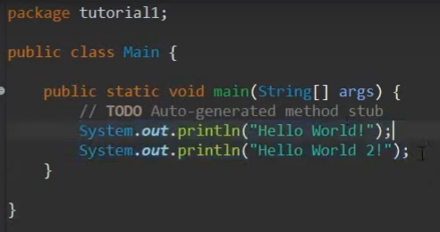
## (0:06:18) Variables & Data Types  
[(0:06:18) Variables & Data Types](https://www.youtube.com/watch?v=GoXwIVyNvX0&t=378s)  
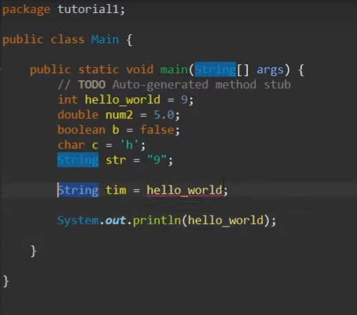
## (0:17:55) Basic Operators  
[(0:17:55) Basic Operators](https://www.youtube.com/watch?v=GoXwIVyNvX0&t=1075s)  
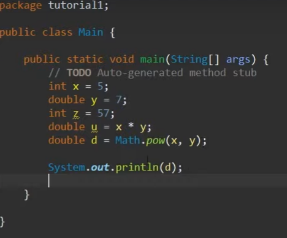
  
## (0:29:36) Input and Scanners  
[(0:29:36) Input and Scanners](https://www.youtube.com/watch?v=GoXwIVyNvX0&t=1776s)  
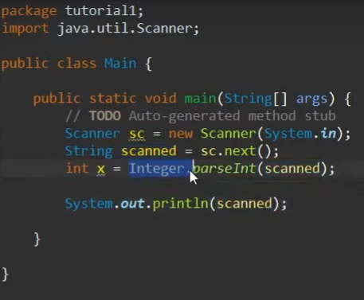
  
## (0:38:40) Conditions and Booleans  
[(0:38:40) Conditions and Booleans](https://www.youtube.com/watch?v=GoXwIVyNvX0&t=2320s)  
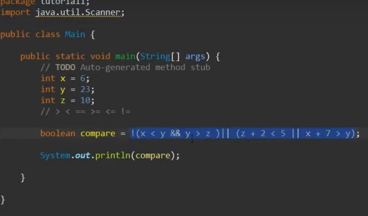
  
## (0:49:54) If/Else/Else If  
[(0:49:54) If/Else/Else If](https://www.youtube.com/watch?v=GoXwIVyNvX0&t=2994s)  
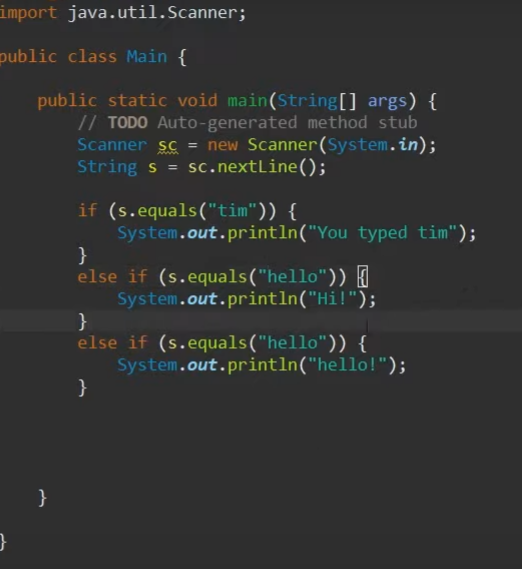
  
## (1:00:08) Nested Statements  
[(1:00:08) Nested Statements](https://www.youtube.com/watch?v=GoXwIVyNvX0&t=8s)  
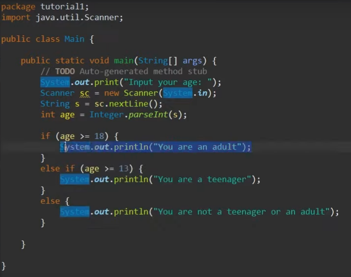

## (1:07:18) Arrays  
[(1:07:18) Arrays](https://www.youtube.com/watch?v=GoXwIVyNvX0&t=438s)  
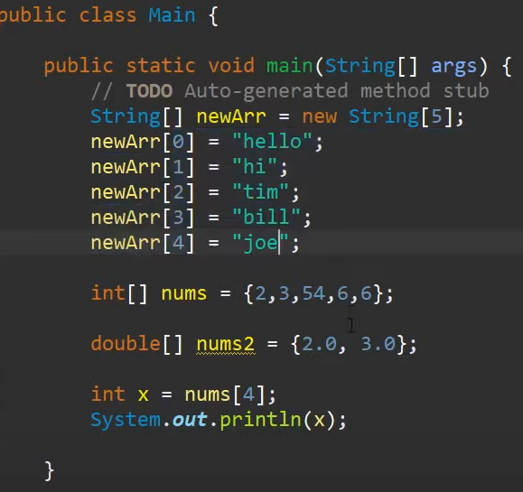
  
## (1:15:29) For Loops  
[(1:15:29) For Loops](https://www.youtube.com/watch?v=GoXwIVyNvX0&t=929s)  
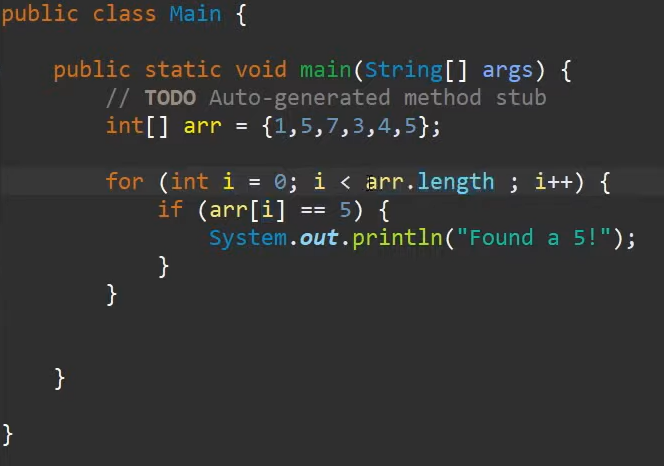
  
## (1:24:46) For Loops (Continued)  
[(1:24:46) For Loops (Continued)](https://www.youtube.com/watch?v=GoXwIVyNvX0&t=1486s)  
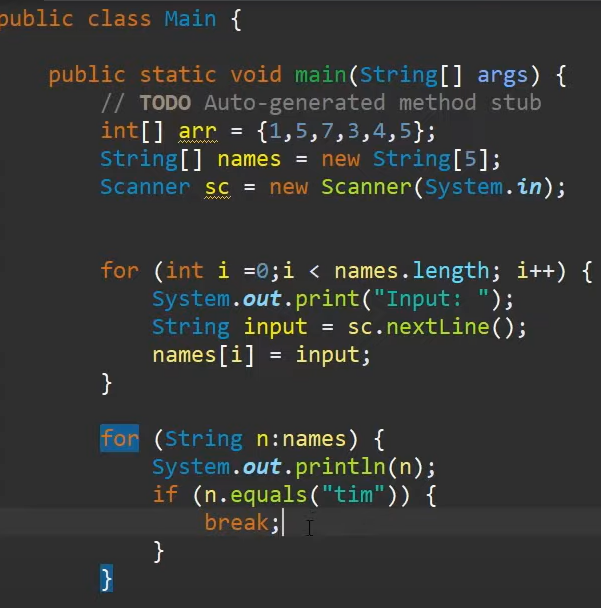
  
## (1:34:10) While Loops  
[(1:34:10) While Loops](https://www.youtube.com/watch?v=GoXwIVyNvX0&t=2050s)  
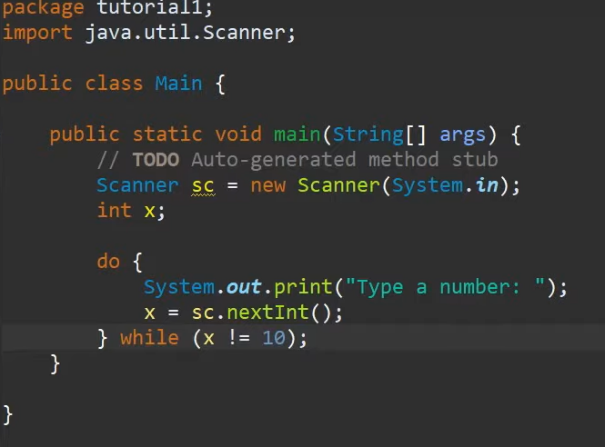
  
## (1:40:50) Sets and Lists  
[(1:40:50) Sets and Lists](https://www.youtube.com/watch?v=GoXwIVyNvX0&t=2450s)  
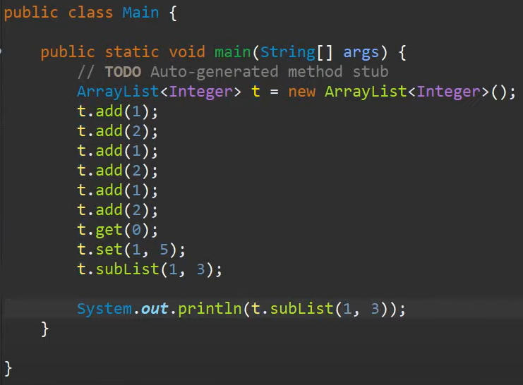
  
## (1:55:25) Maps & HashMaps  
[(1:55:25) Maps & HashMaps](https://www.youtube.com/watch?v=GoXwIVyNvX0&t=3325s)  
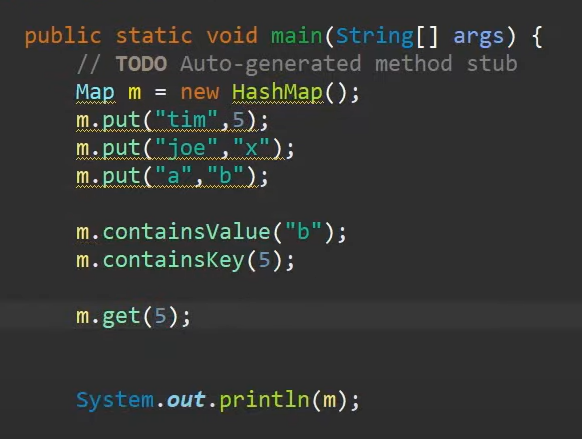
  
## (2:07:46) Maps Example  
[(2:07:46) Maps Example](https://www.youtube.com/watch?v=GoXwIVyNvX0&t=466s)  
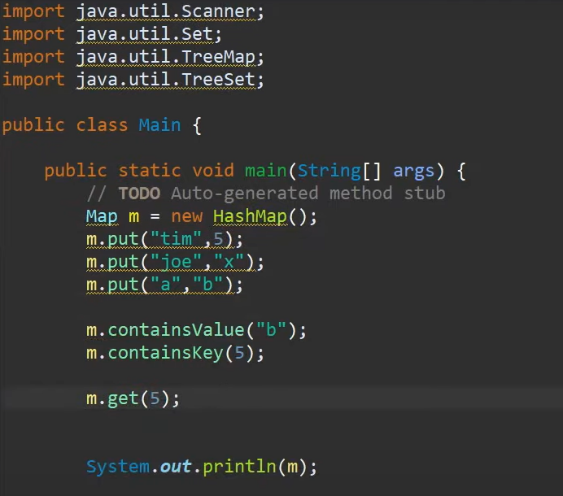
  
## (2:16:09) Introduction to Objects  
[(2:16:09) Introduction to Objects](https://www.youtube.com/watch?v=GoXwIVyNvX0&t=969s)  
  
## (2:29:05) Creating Classes  
[(2:29:05) Creating Classes](https://www.youtube.com/watch?v=GoXwIVyNvX0&t=1745s)  
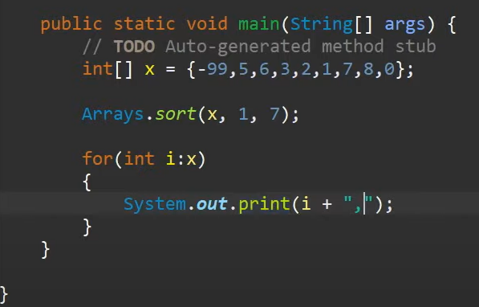
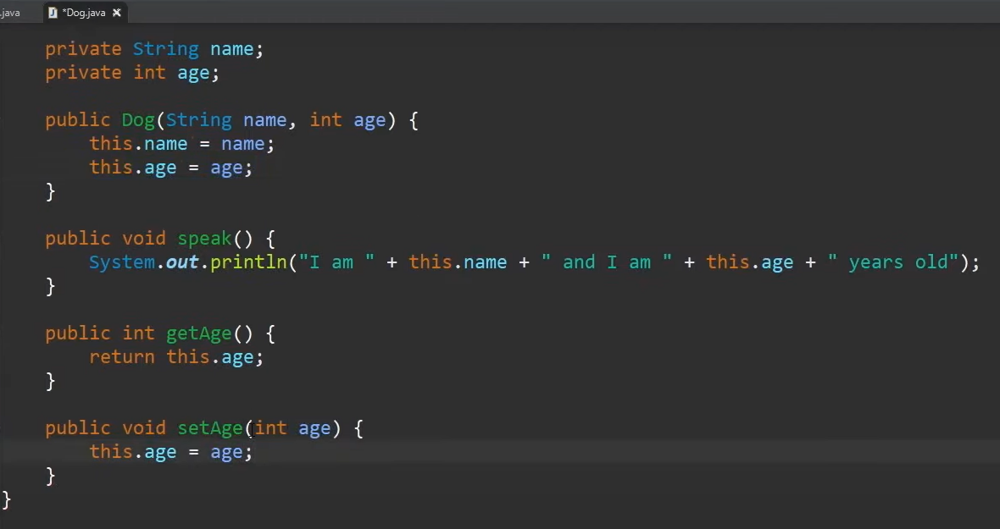
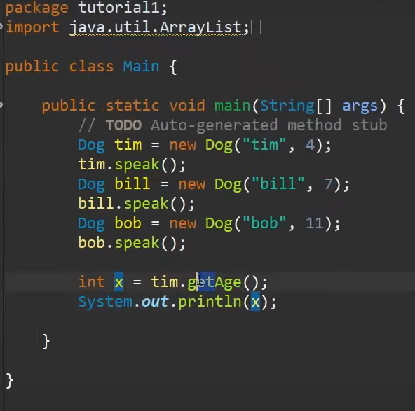  
  
## (2:44:06) Inheritance  
[(2:44:06) Inheritance](https://www.youtube.com/watch?v=GoXwIVyNvX0&t=2646s)  
  
## (2:57:50) What Does STATIC Mean?  
[(2:57:50) What Does STATIC Mean?](https://www.youtube.com/watch?v=GoXwIVyNvX0&t=3470s)  
  
## (3:07:02) Overloading Methods & Object Comparisons  
[(3:07:02) Overloading Methods & Object Comparisons](https://www.youtube.com/watch?v=GoXwIVyNvX0&t=422s)  
  
## (3:17:37) Inner Classes  
[(3:17:37) Inner Classes](https://www.youtube.com/watch?v=GoXwIVyNvX0&t=1057s)  
  
## (3:25:23) Interfaces  
[(3:25:23) Interfaces](https://www.youtube.com/watch?v=GoXwIVyNvX0&t=1523s)  
  
## (3:37:32) Enums  
[(3:37:32) Enums](https://www.youtube.com/watch?v=GoXwIVyNvX0&t=2252s)  
