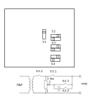

## (1, 2) Фазан ПСС
  
  

№|Кл.|Меню|О/Н|Примечание
--|--|--|--|--
1|F0|ПШ|O|
2|K0|МУ-ДУ|O|
3|K1|№ канала|O|
||||
4|F6|Запись каналов|Н|
5|F1|Режим в РПЗУ, ПШ, МУ-ДУ,(ТЛФ, ДУ-4)|Н|
6|F5|Тестирование|Н|
7|F4|Набор частоты|Н|

## (3, 4) Р-862
  

Р-862 | 97 | Назначение | Примечание
--|--|--|--
1|10|Корпус|
18|3|НОТ|
1|4|НОТ ОП|
19|1|ВОТ|Не используется
27|9|Тангента|
49|8|Мкф. ОП|
50|7|Мкф|

## (5) Р-864
  
  
Р-864 | 97 | Назначение | Примечание
--|--|--|--
1|10|Корпус|
1|4|НОТ ОП|
1|8|Мкф. ОП|
38|3|НОТ|
39|1|ВОТ|Не используется
42|7|Мкф|
49|9|Тангента|

## Кросс
A|Б
--|--
Корп.|ТОН
Танг.|Мкф

## УДВР

№|Назначение||Примечание
--|--|--|--
2|НОТ||
3|ВОТ||
5|ТЛФ ОП||
11|+27 В||
12|Тангента||
14|МКФ ОП||
15|МКФ||

УДВР|Назначение||Вьюга
--|--|--|--
2|НОТ|1|2
5|ТЛФ ОП|3|3
12|Тангента|4|27
14|МКФ ОП|6|6
15|МКФ|5|5
|Корп|7|1,4,7,28

  

№|Назначение||Примечание
--|--|--|--
S1|Средняя точка трансформатора||
S4|Тангента gnd Uпит||
S2|2R6||
S3|3R6||
|||

  
## ПАР  

№|Назначение||Примечание
--|--|--|--
27|ТЛФ 0.5В+|3|
36|ТЛФ 0.5В-|4|
28|МКФ 0.5В+|7|
38|МКФ 0.5В-|8|
37|Экран|10|
41|Тангента|9|

  
## Прима кв

  
#### _______________________________
#### _______________________________
#### _______________________________
    
  
  
