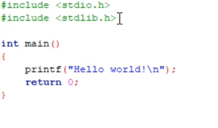
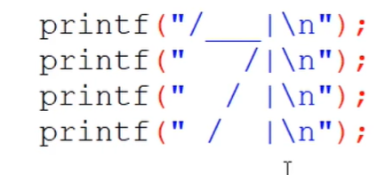
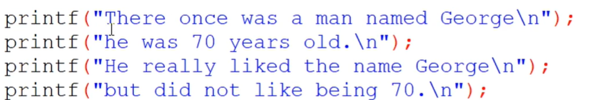
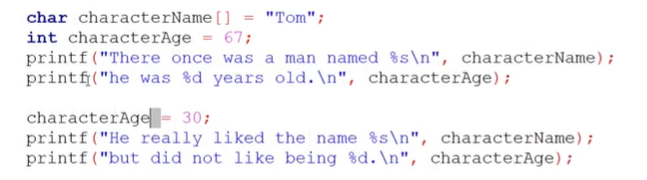
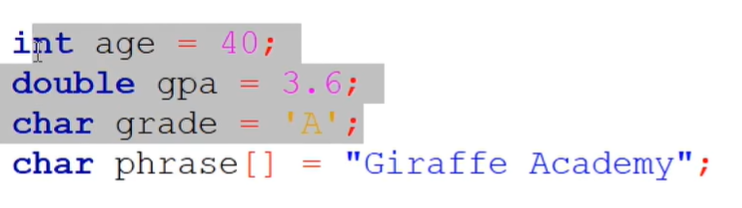

## C Programming Tutorial for Beginners1

1 [(0:00:00) Introduction](#00000-Introduction)  
2 [(0:01:22) Windows Setup](#00122-Windows-Setup)  
3 [(0:05:02) Mac Setup](#00502-Mac-Setup)  
4 [(0:09:04) Hello World](#00904-Hello-World)  
5 [(0:12:51) Drawing a Shape](#01251-Drawing-a-Shape)  
6 [(0:20:56) Variables](#02056-Variables)  
7 [(0:32:25) Data Types](#03225-Data-Types)  
8 [(0:38:32) Printf](#03832-Printf)  
9 [(0:45:22) Working With Numbers](#04522-Working-With-Numbers)  
10 [(0:52:20) Comments](#05220-Comments)  
11 [(0:56:00) Constants](#05600-Constants)  
12 [(1:00:13) Getting User Input](#10013-Getting-User-Input)  
13 [(1:12:08) Building a Basic Calculator](#11208-Building-a-Basic-Calculator)  
14 [(1:17:43) Building a Mad Libs Game](#11743-Building-a-Mad-Libs-Game)  
15 [(1:26:29) Arrays](#12629-Arrays)  
16 [(1:36:44) Functions](#13644-Functions)  
17 [(1:45:37) Return Statement](#14537-Return-Statement)  
18 [(1:53:21) If Statements](#15321-If-Statements)  
19 [(2:07:11) Building a Better Calculator](#20711-Building-a-Better-Calculator)  
20 [(2:14:51) Switch Statements](#21451-Switch-Statements)  
21 [(2:21:27) Structs](#22127-Structs)  
22 [(2:29:43) While Loops](#22943-While-Loops)  
23 [(2:37:48) Building a Guessing Game](#23748-Building-a-Guessing-Game)  
24 [(2:50:11) For Loops](#25011-For-Loops)  
25 [(2:59:05) 2D Arrays & Nested Loops](#25905-2D-Arrays-&-Nested-Loops)  
26 [(3:09:10) Memory Addresses](#30910-Memory-Addresses)  
27 [(3:17:20) Pointers](#31720-Pointers)  
28 [(3:27:41) Dereferencing Pointers](#32741-Dereferencing-Pointers)  
29 [(3:32:37) Writing Files](#33237-Writing-Files)  
30 [(3:41:52) Reading Files](#34152-Reading-Files)  
## (0:00:00) Introduction  
[(0:00:00) Introduction](https://www.youtube.com/watch?v=KJgsSFOSQv0&t=0s)  
g++ hello.cpp -o out.exe; .\out.exe  
## (0:01:22) Windows Setup  
[(0:01:22) Windows Setup](https://www.youtube.com/watch?v=KJgsSFOSQv0&t=82s)  
  
## (0:05:02) Mac Setup  
[(0:05:02) Mac Setup](https://www.youtube.com/watch?v=KJgsSFOSQv0&t=302s)  
  
## (0:09:04) Hello World  
[(0:09:04) Hello World](https://www.youtube.com/watch?v=KJgsSFOSQv0&t=544s)  

## (0:12:51) Drawing a Shape  
[(0:12:51) Drawing a Shape](https://www.youtube.com/watch?v=KJgsSFOSQv0&t=771s)  

  
## (0:20:56) Variables  
[(0:20:56) Variables](https://www.youtube.com/watch?v=KJgsSFOSQv0&t=1256s)  


  
## (0:32:25) Data Types  
[(0:32:25) Data Types](https://www.youtube.com/watch?v=KJgsSFOSQv0&t=1945s)  
  
  
## (0:38:32) Printf  
[(0:38:32) Printf](https://www.youtube.com/watch?v=KJgsSFOSQv0&t=2312s)  
```
#include<stdio.h>

int main(){
  printf("My favorite %s is %f \n", "number", 500.22);
  int num = 90;
  printf("next number is %d", num);
  return 0;
}
// My favorite number is 500.220000 
// next number is 90
```  
## (0:45:22) Working With Numbers  
[(0:45:22) Working With Numbers](https://www.youtube.com/watch?v=KJgsSFOSQv0&t=2722s)  
```
#include<stdio.h>
#include<math.h>

int main(){
  printf("%f\n", pow(2, 3));
  printf("%f", sqrt(2));
  return 0;
}
// 8.000000
// 1.414214
```  
## (0:52:20) Comments  
[(0:52:20) Comments](https://www.youtube.com/watch?v=KJgsSFOSQv0&t=3140s)  
```
//
/*   */
```  
## (0:56:00) Constants  
[(0:56:00) Constants](https://www.youtube.com/watch?v=KJgsSFOSQv0&t=3360s)  
```
int main(){
  const int NUM = 5;
  int num = 7;
  printf(" num = %d", num);
  printf(" NUM = %d", NUM);
 
  return 0;
}
//  num = 7 NUM = 5
```  
## (1:00:13) Getting User Input  
[(1:00:13) Getting User Input](https://www.youtube.com/watch?v=KJgsSFOSQv0&t=13s)  
```
int main(){
  double gpa;
  printf("Enter your gpa: ");
  scanf("%lf", &gpa);
  printf("Your gpa is %f\n", gpa);
 
  return 0;
}
// Enter your gpa: 66
// Your gpa is 66.000000
```  
```
#include<stdio.h>


int main(){

char name[20];
printf("Enter your name: ");
fgets(name, 20, stdin);
printf("Your name is %s", name);
 
  return 0;
}
// Enter your name: John Smith
// Your name is John Smith
```  
## (1:12:08) Building a Basic Calculator  
[(1:12:08) Building a Basic Calculator](https://www.youtube.com/watch?v=KJgsSFOSQv0&t=728s)  

## (1:17:43) Building a Mad Libs Game  
[(1:17:43) Building a Mad Libs Game](https://www.youtube.com/watch?v=KJgsSFOSQv0&t=1063s)  
  
## (1:26:29) Arrays  
[(1:26:29) Arrays](https://www.youtube.com/watch?v=KJgsSFOSQv0&t=1589s)  
  
## (1:36:44) Functions  
[(1:36:44) Functions](https://www.youtube.com/watch?v=KJgsSFOSQv0&t=2204s)  
  
## (1:45:37) Return Statement  
[(1:45:37) Return Statement](https://www.youtube.com/watch?v=KJgsSFOSQv0&t=2737s)  
  
## (1:53:21) If Statements  
[(1:53:21) If Statements](https://www.youtube.com/watch?v=KJgsSFOSQv0&t=3201s)  
  
## (2:07:11) Building a Better Calculator  
[(2:07:11) Building a Better Calculator](https://www.youtube.com/watch?v=KJgsSFOSQv0&t=431s)  
  
## (2:14:51) Switch Statements  
[(2:14:51) Switch Statements](https://www.youtube.com/watch?v=KJgsSFOSQv0&t=891s)  
  
## (2:21:27) Structs  
[(2:21:27) Structs](https://www.youtube.com/watch?v=KJgsSFOSQv0&t=1287s)  
  
## (2:29:43) While Loops  
[(2:29:43) While Loops](https://www.youtube.com/watch?v=KJgsSFOSQv0&t=1783s)  
  
## (2:37:48) Building a Guessing Game  
[(2:37:48) Building a Guessing Game](https://www.youtube.com/watch?v=KJgsSFOSQv0&t=2268s)  
  
## (2:50:11) For Loops  
[(2:50:11) For Loops](https://www.youtube.com/watch?v=KJgsSFOSQv0&t=3011s)  
  
## (2:59:05) 2D Arrays & Nested Loops  
[(2:59:05) 2D Arrays & Nested Loops](https://www.youtube.com/watch?v=KJgsSFOSQv0&t=3545s)  
  
## (3:09:10) Memory Addresses  
[(3:09:10) Memory Addresses](https://www.youtube.com/watch?v=KJgsSFOSQv0&t=550s)  
  
## (3:17:20) Pointers  
[(3:17:20) Pointers](https://www.youtube.com/watch?v=KJgsSFOSQv0&t=1040s)  
  
## (3:27:41) Dereferencing Pointers  
[(3:27:41) Dereferencing Pointers](https://www.youtube.com/watch?v=KJgsSFOSQv0&t=1661s)  
  
## (3:32:37) Writing Files  
[(3:32:37) Writing Files](https://www.youtube.com/watch?v=KJgsSFOSQv0&t=1957s)  
  
## (3:41:52) Reading Files  
[(3:41:52) Reading Files](https://www.youtube.com/watch?v=KJgsSFOSQv0&t=2512s)  
  