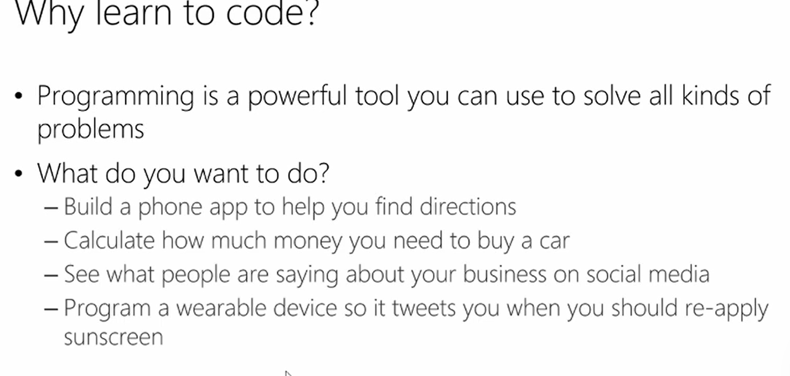

Introduction To Python Programming  
### MODULE 1 Introduction To Python Programming
This module will introduce you to the Concept of Programming and what people can do and have done with programming. You will learn all about Python and why Python is a good programming language to start with. Learn how to use Visual Studio to create a new Python project.
### 2 Introduction To Python Programming - Learning OutcomesStart Topic
### 3 Introduction To PythonStart Topic

### 4 Getting StartedStart Topic
### 5 Best PracticesStart Topic
### 6 Introduction To Python Programming - Lesson Summary

## MODULE 2 Displaying Text
This module will introduce you to displaying text on screen using the using the print function and how to put typed text inside quotes in the print function. You will learn about how python accepts using single, double and triple quotes to display your text and the differences in uses each of them. It is important to know that everyone makes mistakes when programming and you will be shown recommended solutions to help fix mistakes.
### Displaying Text - Learning OutcomesStart Topic
### Displaying TextStart Topic
### When Good Code Goes BadStart Topic
### Displaying Text - Lesson Summary

## MODULE 3 String Variables
This module will show you how to get the user to input data. You will learn about creating variables as well as the rules and guidelines for creating them, along with printing your variable on screen. Learn about combining variables and strings using the + symbol and how to manipulate your variables using built in functions as well as what functions are. You will learn about Visual Studio’s IntelliSense feature and its helpfulness for programming.
### String Variables - Learning OutcomesStart Topic
### Expecting Input And Intro To VariablesStart Topic
### Variable Rules And Working With VariablesStart Topic
### Visual Studio TricksStart Topic
### String Variables - Lesson Summary

https://alison.com/courses/programming-concepts-with-python-revised/content  
http://aka.ms/intopythoncode  
https://github.com/GeekTrainer/Introduction-Programming-Python  
  
  
  
  
  
  
  
  
